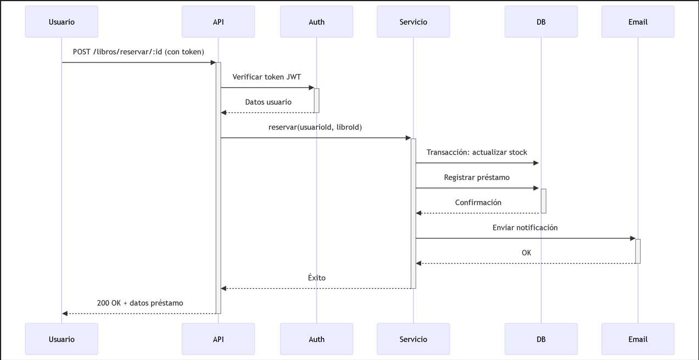

# 📚 Biblioteca  - API REST

Un sistema de gestión de biblioteca digital con autenticación de usuarios, préstamos de libros y administración completa.

## 🛠 Tecnologías Utilizadas

- **Backend**:
  - Node.js
  - Express.js
  - MongoDB (Mongoose)
  - JWT (Autenticación)
  - Nodemailer (Notificaciones por email)

- **Testing**:
  - Mocha
  - Chai
  - Supertest

- **Variables de Entorno**:
  - dotenv

## ✨ Características Principales

✅ Autenticación segura con JWT  
✅ Roles de usuario (admin/user)  
✅ CRUD completo de libros  
✅ Sistema de préstamos con límites  
✅ Historial de préstamos  
✅ Notificaciones por email  
✅ Validación de datos  
✅ Estadísticas de la biblioteca  
✅ 100% cubierto por pruebas automatizadas  

## 🚀 Cómo Instalar y Ejecutar

### Requisitos Previos
- Node.js (v18+)
- MongoDB (local o Atlas)
- Cuenta Ethereal (para emails de prueba) o servicio SMTP

### Pasos de Instalación

1. Clonar el repositorio:
```bash
git clone https://github.com/tu-usuario/tu-repositorio.git
cd tu-repositorio
```

2. Instalar dependencias:
```bash
npm install
```

3. Configurar variables de entorno:
```bash
cp .env.example .env
```
Editar el archivo `.env` con tus credenciales.

4. Iniciar el servidor:
```bash
npm start
```

5. Ejecutar pruebas (opcional):
```bash
npm test
```

## 📝 Documentación de la API

La API sigue el estándar REST y requiere autenticación para la mayoría de endpoints.

### Autenticación
```http
POST /api/usuarios/registro
POST /api/usuarios/login
```

### Libros
```http
GET    /api/libros
POST   /api/libros          (Admin)
PUT    /api/libros/:id      (Admin)
DELETE /api/libros/:id      (Admin)
POST   /api/libros/reservar/:id
POST   /api/libros/devolver/:id
GET    /api/libros/estadisticas
```

### Usuarios
```http
GET    /api/usuarios               (Admin)
GET    /api/usuarios/mis-prestamos
PUT    /api/usuarios/:id/rol       (Admin)
DELETE /api/usuarios/:id           (Admin)
```

## 🌐 Endpoints Públicos

- Registro de usuarios
- Login
- Listado de libros
- Estadísticas

## 🔒 Endpoints Protegidos

Requieren token JWT en el header `Authorization: Bearer <token>`

## 📊 Estructura del Proyecto

TP2_TrabajoIntegrador/
├── .env
├── .gitignore
├── package.json
├── README.md
├── app.js
├── config.js
├── src/
│   ├── controlador/
│   │   ├── libros.js
│   │   └── usuarios.js
│   ├── modelo/
│   │   ├── DBMongo.js
│   │   └── DAO/
│   │       ├── models/
│   │       │   ├── libro.js
│   │       │   └── usuario.js
│   ├── routes/
│   │   ├── libros.js
│   │   └── usuarios.js
│   ├── servicio/
│   │   ├── auth.js
│   │   ├── libros.js
│   │   ├── rol.js
│   │   └── usuarios.js
│   └── Utils/
│       ├── email.js
│       └── emailDevolucion.js
└── test/
    └── api.test.js

## 🧪 Ejecutando las Pruebas

El proyecto incluye pruebas completas de integración:

```bash
npm test
```

Cubre:
- Autenticación
- CRUD de libros
- Préstamos y devoluciones
- Validaciones
- Control de errores

## 🤝 Funcionalidades Principales destacadas:
📚 Funcionalidades Principales

👥 Módulo de Usuarios

+ Registro público de usuarios
+ Autenticación con JWT (JSON Web Tokens)
+ Roles diferenciados (Admin/Usuario normal)
+ Perfil de usuario con historial de préstamos
+ Administración completa de usuarios (solo admin)
+ Cambio de roles (admin puede promover usuarios)

📖 Módulo de Libros

+ CRUD completo de libros (solo admin)
+ Búsqueda de libros por ID o todos
+ Sistema de stock con tracking:
   - Stock total vs. disponible
   - Libros prestados actualmente
+ Estadísticas en tiempo real:
   - Libros disponibles/prestados
   - Usuarios activos

🔄 Sistema de Préstamos

+ Reserva de libros con validaciones:
   - Límite de 3 libros por usuario
   - No duplicar préstamos del mismo libro
   - Verificación de stock disponible
+ Devoluciones con registro de fecha
+ Historial completo de préstamos
+ Notificaciones automáticas por email:
   - Al reservar
   - Al devolver

🛡️ Seguridad y Validaciones

+ Middleware de autenticación JWT
+ Control de acceso por roles
+ Validación de datos en todos los endpoints
+ Manejo estructurado de errores
+ Protección contra:
   - Usuarios no autenticados
   - Roles no autorizados
   - Datos malformados

📊 Dashboard Administrativo

+ Métricas clave:
   - Total de libros
   - Préstamos activos
   - Usuarios registrados
+ Herramientas de mantenimiento:
   - Eliminación segura (valida préstamos activos)
   - Actualización masiva de stock

✉️ Sistema de Notificaciones

+ Emails automáticos con Nodemailer
+ Plantillas para:
   - Confirmación de préstamo
   - Recordatorio de devolución
   - Confirmación de devolución
+ Integración con servicios SMTP (como Ethereal para pruebas)

🔧 Funcionalidades Técnicas Avanzadas
markdown
- ✔️ Transacciones ACID para operaciones críticas (préstamos/devoluciones)
- ✔️ Validación de esquemas con Mongoose
- ✔️ Variables de entorno configurables
- ✔️ 100% cubierto por pruebas automatizadas (Mocha/Chai)
- ✔️ API RESTful con Express.js
- ✔️ Documentación Postman incluida

## Diagrama de Secuencia 


